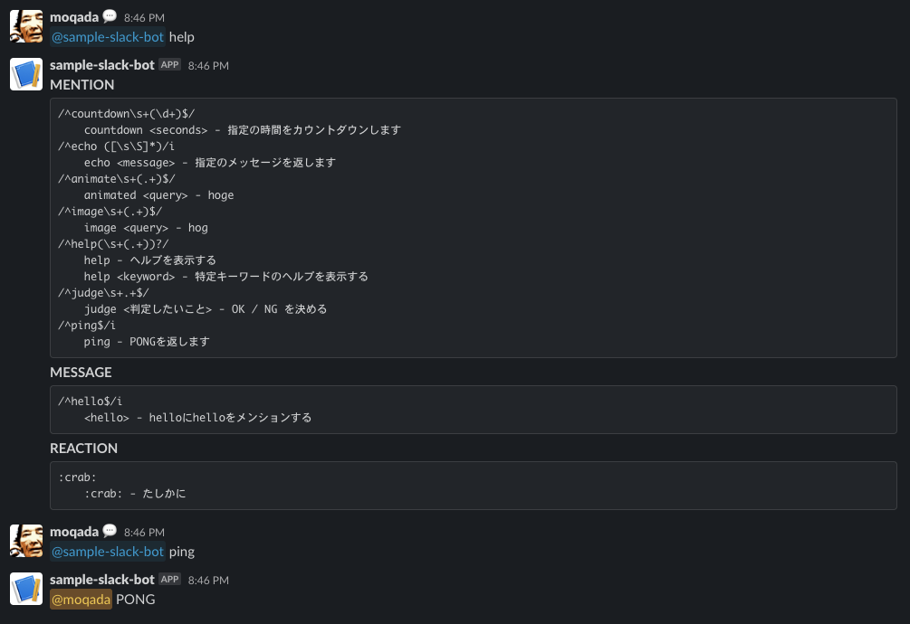

# Sample Slack Bot

The sample of the generic Slack Bot that works on
[the Slack Next-gen platform](https://api.slack.com/future).



**Guide Outline**:

- [Setup](#setup)
  - [Install the Slack CLI](#install-the-slack-cli)
  - [Set Environment Variables](#set-environment-variables)
- [Running Your Project Locally](#running-your-project-locally)
- [Testing](#testing)
- [Deploying Your App](#deploying-your-app)
  - [Viewing Activity Logs](#viewing-activity-logs)
- [Project Structure](#project-structure)
- [Resources](#resources)

---

## Setup

Before getting started, make sure you have a development workspace where you
have permissions to install apps. If you don’t have one set up, go ahead and
[create one](https://slack.com/create). Also, please note that the workspace
requires any of [the Slack paid plans](https://slack.com/pricing).

### Install the Slack CLI

To use this, you first need to install and configure the Slack CLI. Step-by-step
instructions can be found in our
[Quickstart Guide](https://api.slack.com/future/quickstart).

### Set Environment Variables

[`bot/mention/google_image.ts`](bot/mention/google_image.ts) need the
environment variables.

You should get some variables from
[Google Custom Search API](https://developers.google.com/custom-search/docs/overview),
and you need to create the following `.env` file.

```
GOOGLE_CSE_ID=XXXXXXXXXXXXXXXXXXXXXX
GOOGLE_CSE_KEY=YYYYYYYYYYYYYYYYYYYY
```

## Running Your Project Locally

While building your app, you can see your changes propagated to your workspace
in real-time with `slack run`. In both the CLI and in Slack, you'll know an app
is the development version if the name has the string `(dev)` appended.

```zsh
# Run app locally
$ slack run

Connected, awaiting events
```

To stop running locally, press `<CTRL> + C` to end the process.

After running, you can see a question about the trigger then you choose
`triggers/configure_bot.ts`.

```
? Choose a trigger definition file: triggers/configure_bot.ts
```

Or you can run the below command.

```zsh
slack trigger create --trigger-def triggers/configure_bot.ts
```

As a result, you can get the link trigger Shortcut URL. Copy and paste this URL
into a channel as a message. After that, you follow the instruction in the modal
then you can set up the necessary workflows.

## Testing

Test filenames should be suffixed with `_test`. Run all tests with `deno test`:

```zsh
$ deno test
```

## Deploying Your App

Once you're done with development, you can deploy the production version of your
app to Slack hosting using `slack deploy`:

```zsh
$ slack deploy
```

After deploying, create new link triggers for the production version of your app
(not appended with `(dev)`). Once the triggers are invoked, the associated
workflows should run just as they did when developing locally.

### Viewing Activity Logs

Activity logs for the production instance of your application can be viewed with
the `slack activity` command:

```zsh
$ slack activity
```

## Project Structure

### `manifest.ts`

The [app manifest](https://api.slack.com/future/manifest) contains the app's
configuration. This file defines attributes like app name and description.

### `slack.json`

Used by the CLI to interact with the project's SDK dependencies. It contains
script hooks that are executed by the CLI and implemented by the SDK.

### `/bot`

The main logics of the bot. You can implement some event handlers (ex.
`mention`, `message`, `reaction`).

### `/functions`

[Functions](https://api.slack.com/future/functions) are reusable building blocks
of automation that accept inputs, perform calculations, and provide outputs.
Functions can be used independently or as steps in workflows.

### `/workflows`

A [workflow](https://api.slack.com/future/workflows) is a set of steps that are
executed in order. Each step in a workflow is a function.

Workflows can be configured to run without user input or they can collect input
by beginning with a [form](https://api.slack.com/future/forms) before continuing
to the next step.

### `/triggers`

[Triggers](https://api.slack.com/future/triggers) determine when workflows are
executed. A trigger file describes a scenario in which a workflow should be run,
such as a user pressing a button or when a specific event occurs.

## Resources

To learn more about developing with the CLI, you can visit the following guides:

- [Creating a new app with the CLI](https://api.slack.com/future/create)
- [Configuring your app](https://api.slack.com/future/manifest)
- [Developing locally](https://api.slack.com/future/run)

To view all documentation and guides available, visit the
[Overview page](https://api.slack.com/future/overview).
